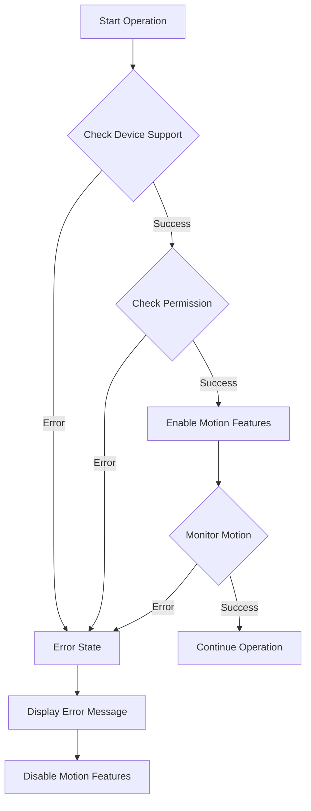

# Error Handling Flow Diagram

This diagram represents the error handling flows and recovery paths based on motion-status.test.rac.yaml.

```mermaid
flowchart TD
    A[Start Operation] --> B{Check Device Support}
    B -->|Error| C[Error State]
    B -->|Success| D{Check Permission}
    
    C --> E[Display Error Message]
    E --> F[Disable Motion Features]
    
    D -->|Error| C
    D -->|Success| G[Enable Motion Features]
    
    G --> H{Monitor Motion}
    H -->|Error| C
    H -->|Success| I[Continue Operation]
``` 