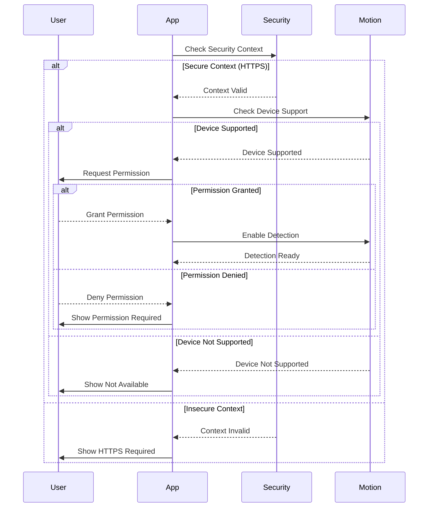

# Motion Detection Permission Flow Diagram

This diagram represents the sequence of interactions between different components for motion detection permission handling.

```mermaid
sequenceDiagram
    participant User
    participant App
    participant Security
    participant Motion
    
    App->>Security: Check Security Context
    alt Secure Context (HTTPS)
        Security-->>App: Context Valid
        App->>Motion: Check Device Support
        alt Device Supported
            Motion-->>App: Device Supported
            App->>User: Request Permission
            alt Permission Granted
                User-->>App: Grant Permission
                App->>Motion: Enable Detection
                Motion-->>App: Detection Ready
            else Permission Denied
                User-->>App: Deny Permission
                App->>User: Show Permission Required
            end
        else Device Not Supported
            Motion-->>App: Device Not Supported
            App->>User: Show Not Available
        end
    else Insecure Context
        Security-->>App: Context Invalid
        App->>User: Show HTTPS Required
    end
``` 