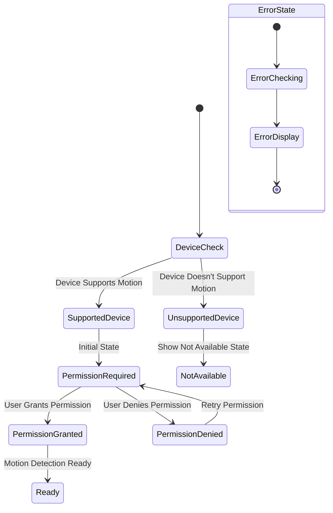

# Motion Status Flow Diagram

This diagram represents the flow of motion status checking and permission handling based on motion-status.test.rac.yaml.

```mermaid
stateDiagram-v2
    [*] --> DeviceCheck
    DeviceCheck --> SupportedDevice: Device Supports Motion
    DeviceCheck --> UnsupportedDevice: Device Doesn't Support Motion
    
    SupportedDevice --> PermissionRequired: Initial State
    PermissionRequired --> PermissionGranted: User Grants Permission
    PermissionRequired --> PermissionDenied: User Denies Permission
    PermissionGranted --> Ready: Motion Detection Ready
    PermissionDenied --> PermissionRequired: Retry Permission
    
    UnsupportedDevice --> NotAvailable: Show Not Available State
    
    state ErrorState {
        [*] --> ErrorChecking
        ErrorChecking --> ErrorDisplay
        ErrorDisplay --> [*]
    }
``` 