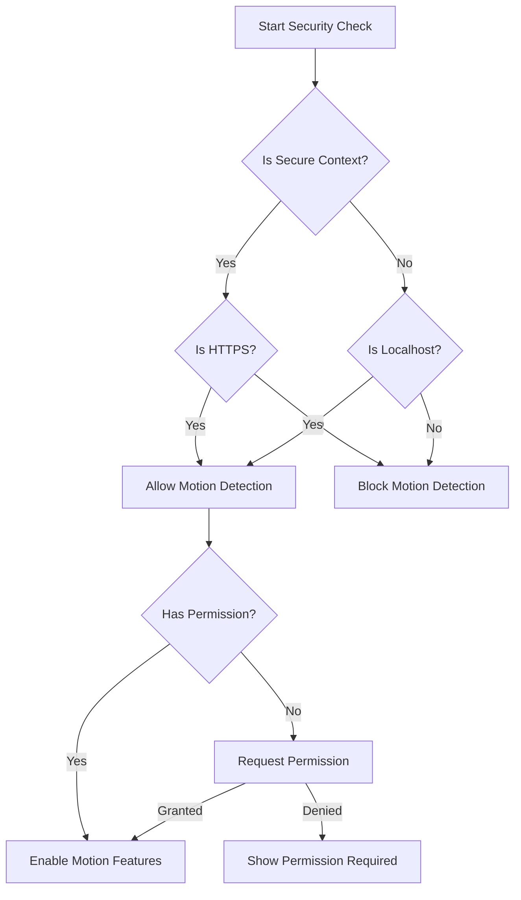

# Security Context Flow Diagram

This diagram represents the security context validation and its impact on motion detection based on security-requirements.test.rac.yaml.

```mermaid
flowchart TD
    A[Start Security Check] --> B{Is Secure Context?}
    B -->|Yes| C{Is HTTPS?}
    B -->|No| D{Is Localhost?}
    
    C -->|Yes| E[Allow Motion Detection]
    C -->|No| F[Block Motion Detection]
    
    D -->|Yes| E
    D -->|No| F
    
    E --> G{Has Permission?}
    G -->|Yes| H[Enable Motion Features]
    G -->|No| I[Request Permission]
    I -->|Granted| H
    I -->|Denied| J[Show Permission Required]
``` 